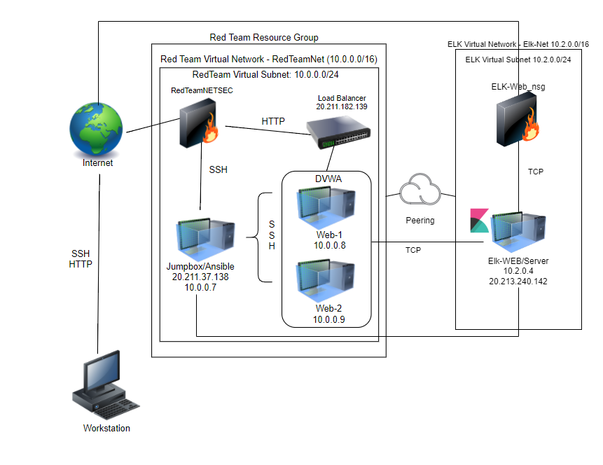

# CyberxSecurity
CyberSecurity Modules
## Automated ELK Stack Deployment

The files in this repository were used to configure the network depicted below.

**Note**: The following image link needs to be updated. Replace `diagram_filename.png` with the name of your diagram image file.  

These files have been tested and used to generate a live ELK deployment on Azure. They can be used to either recreate the entire deployment pictured above. Alternatively, select portions of the YML playbook file may be used to install only certain pieces of it, such as Filebeat.

  - _TODO: PentestYML.txt

This document contains the following details:
- Description of the Topologu
- Access Policies
- ELK Configuration
  - Beats in Use
  - Machines Being Monitored
- How to Use the Ansible Build

### Description of the Topology

The main purpose of this network is to expose a load-balanced and monitored instance of DVWA, the D*mn Vulnerable Web Application.

Load balancing ensures that the application will be highly available and accessible through workload distribution, in addition to restricting traffic to the network.
- _TODO: What aspect of security do load balancers protect? What is the advantage of a jump box?_
Load balancers help to shift traffic from one server to the cloud server. If there is a DDOS attack on the main server, the load balancer reroutes traffic, adding additional layers of security.

The advantage of a Jump Box is that it prevents Azure VMs from exposing their public IP address. It serves as a link between the trusted networks, which allows monitoring and loggin from a single box.  

Integrating an ELK server allows users to easily monitor the vulnerable VMs for changes to the network and system logs.
- _TODO: What does Filebeat watch for?_
Filebeat watches and monitors log files or locations that you specify, collects log events and forwards them to either Elasticsearch or Logstash for indexing
- _TODO: What does Metricbeat record?_
Metricbeat collects metrics and statistics from the operating system and other specific services on the server and creates an user specified output in either Logstash or Elasticsearch

The configuration details of each machine may be found below.
_Note: Use the [Markdown Table Generator](http://www.tablesgenerator.com/markdown_tables) to add/remove values from the table_.

| Name     | Function | IP Address | Operating System |
|----------|----------|------------|------------------|
| Jump Box | Gateway  | 10.0.0.1   | Linux            |
| Web-1	   | Ubuntu   | 10.0.0.5   | Linux            |
| Web-2    | Ubuntu   | 10.0.0.7   | Linux            |
| Elk-Web  | Ubuntu   | 10.2.04    | Linux            |
| Web-3    | Ubuntu   | 10.0.0.6   |                  |

### Access Policies

The machines on the internal network are not exposed to the public Internet. 

Only the Jump Box machine can accept connections from the Internet. Access to this machine is only allowed from the following IP addresses:
- _TODO: CPU ipv4 "My IP Address"

Machines within the network can only be accessed by my Workstation and the Jump Box, connecting through SSH (Port 22).
- _TODO: Which machine did you allow to access your ELK VM? What was its IP address?_
The Jump Box was able to access my ELK VM through SSH, IP Address: 10.2.0.4
A summary of the access policies in place can be found in the table below.

| Name     | Publicly Accessible | Allowed IP Addresses 	 |
|----------|---------------------|-------------------------------|
| Jump Box | Yes                 | 20.227.167.176 | 10.0.0.4[SSH]|
| Web-1    | No                  | 10.2.0.4 [SSH]                |
| Web-2    | No                  | 10.2.0.4 [SSH]              	 |
| Elk-Web  | No			 | <my.IPV4> [TCP]
### Elk Configuration

Ansible was used to automate configuration of the ELK machine. No configuration was performed manually, which is advantageous because...
- _TODO: What is the main advantage of automating configuration with Ansible?_
There are multiple advantages of automating configuration with Ansible. The main one would be the ability to cloud platforms and virtualized hosts, network devices etc. to allow application deployment on each host machine using SSH.

The playbook implements the following tasks:
- _TODO: In 3-5 bullets, explain the steps of the ELK installation play. E.g., install Docker; download image; etc._
- Specify machine group
- Install Docker.io
- Install Python-pip
- Increase the Virtual memory
- Download and Launch ELK Docker Container [publish ports for availability]
- Enable Docker on Boot

The following screenshot displays the result of running `docker ps` after successfully configuring the ELK instance.

**Note**: The following image link needs to be updated. Replace `docker_ps_output.png` with the name of your screenshot image file.  

### Target Machines & Beats
This ELK server is configured to monitor the following machines:
- _TODO: List the IP addresses of the machines you are monitoring_
- Web-1: 10.0.0.5
- Web-2: 10.0.0.6
- Web-3: 10.0.0.7

We have installed the following Beats on these machines:
- _TODO: Specify which Beats you successfully installed_
- Filebeat
- Metricbeat

These Beats allow us to collect the following information from each machine:
- _TODO: In 1-2 sentences, explain what kind of data each beat collects, and provide 1 example of what you expect to see. E.g., `Winlogbeat` collects Windows logs, which we use to track user logon events, etc._
- Filebeat collects log files from specific sources, ie. Apache, Azure Servers, MySQL. You can use log input to read lines from log files (requires type, path, fields etc.)
- Metricbeat collects data on Virtual Machines, system files, CPU memory and network activity. You can use the dashboard to see things like CPU usage over time chart or system load over time charts. Also displays Top Hosts by usage.

### Using the Playbook
In order to use the playbook, you will need to have an Ansible control node already configured. Assuming you have such a control node provisioned: 

SSH into the control node and follow the steps below:
- Copy the playbook YML file to /etc/ansible directory
- Update the hosts & ansible.cfg {configuration} file to include remote user {azadmin} and whitelisted IPs. By specifying groups in the hosts file you can designate which machines the playbook will run on.
- Run the playbook, and navigate to Kibana {localhost:5601} to check that the installation worked as expected.

_As a **Bonus**, provide the specific commands the user will need to run to download the playbook, update the files, etc._

- download playbook: ansible-playbook /etc/ansible/install-elk.yml
- download filebeat playbook and copy to /etc/ansible: curl -L -O https://gist.githubusercontent.com/slape/5cc350109583af6cbe577bbcc0710c93/raw/eca603b72586fbe148c11f9c87bf96a63cb25760/Filebeat > /etc/ansible/filebeat-config.yml
- update filebeat-config.yml file: nano /etc/ansible/filebeat-config.yml, add ELK-WEB  IP 10.2.0.4
- run filebeat playbook: ansible-playbook filebeat-playbook.yml
- dowload metricbeat playbook and copy to /etc/ansible: curl -L -O https://gist.githubusercontent.com/slape/58541585cc1886d2e26cd8be557ce04c/raw/0ce2c7e744c54513616966affb5e9d96f5e12f73/metricbeat > /etc/ansible/files/metricbeat-config.yml
- update metricbeat-config.yml file: nano /etc/ansible/metricbeat-config.yml, add ELK-WEB IP 10.2.0.4
- run metricbeat playbook: ansible-playbook metricbeat-playbook.yml

SOURCES
Filebeat overviewedit. Elastic. (n.d.). Retrieved from https://www.elastic.co/guide/en/beats/filebeat/current/filebeat-overview.html 
Load balancing 101 - learn all about load balancers. (n.d.). Retrieved 0AD, from https://avinetworks.com/what-is-load-balancing/ 
Metricbeat overviewedit. Elastic. (n.d.). Retrieved 0AD, from https://www.elastic.co/guide/en/beats/metricbeat/current/metricbeat-overview.html 
Pandit, N. (2019, July 31). What is Azure Jumpbox? Tutorials Link. Retrieved n.d., from https://www.tutorialslink.com/Articles/What-is-Azure-Jumpbox/1062 
V, P. (2020, November 2). Advantages of ansible automation. Skynats. Retrieved from https://www.skynats.com/blog/advantages-of-ansible-automation/ 
